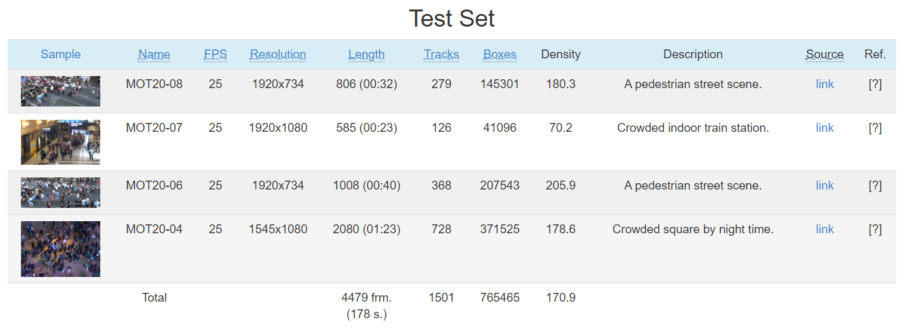
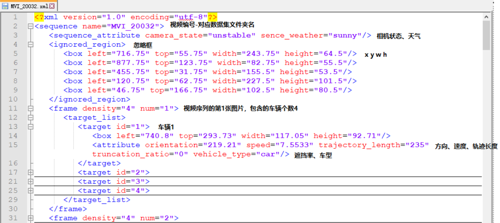
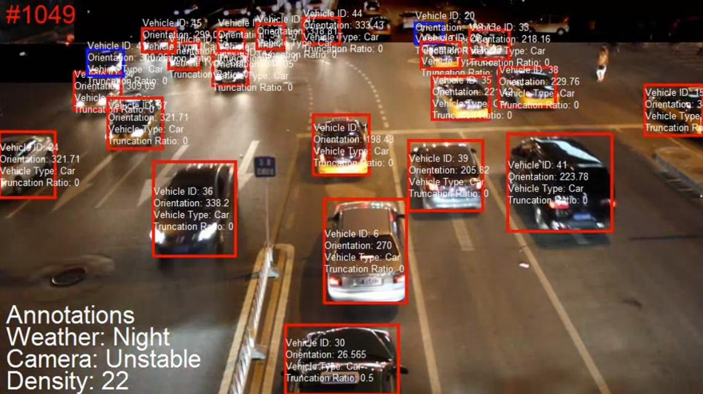
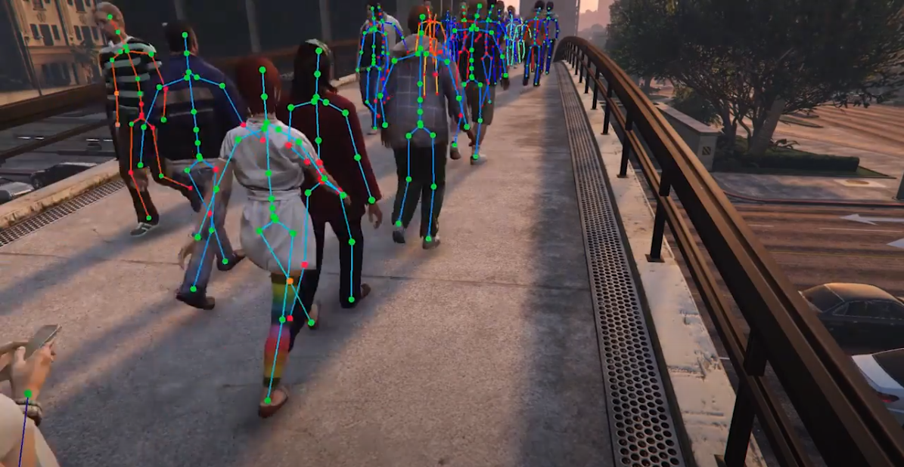
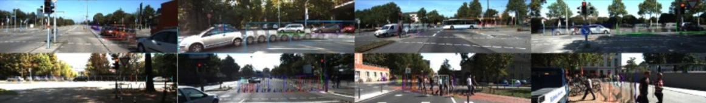
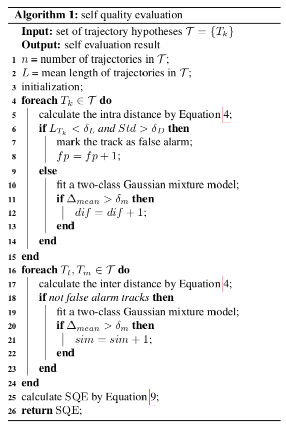

# 多目标跟踪: [](https://github.com/sindresorhus/awesome)

> 归纳整理了比较重要的多目标跟踪论文和资源。

<a id="markdown-目录" name="目录"></a>
## 目录
<!-- TOC -->
- [多目标跟踪: ](#多目标跟踪-)
  - [目录](#目录)
  - [综述论文](#综述论文)
  - [算法论文](#算法论文)
    - [**2023**](#2023)
    - [**2022**](#2022)
    - [**2021**](#2021)
    - [**2020**](#2020)
    - [**2019**](#2019)
    - [**2018**](#2018)
    - [**2017**](#2017)
    - [**2016**](#2016)
  - [数据集](#数据集)
    - [PETS 2009 Benchmark Data](#pets-2009-benchmark-data)
    - [MOT Challenge](#mot-challenge)
      - [MOT20](#mot20)
      - [MOTS](#mots)
    - [UA-DETRAC](#ua-detrac)
    - [WILDTRACK](#wildtrack)
    - [NVIDIA AI CITY Challenge](#nvidia-ai-city-challenge)
    - [VisDrone](#visdrone)
    - [JTA Dataset](#jta-dataset)
    - [Path Track](#path-track)
    - [TAO](#tao)
    - [GMOT-40](#gmot-40)
    - [TAO-OW](#tao-ow)
    - [KITTI-Tracking](#kitti-tracking)
    - [APOLLOSCAPE](#apolloscape)
      - [APOLLO Dection/Tracking](#apollo-dectiontracking)
      - [APOLLO MOTS](#apollo-mots)
    - [Omni-MOT](#omni-mot)
    - [BDD100K](#bdd100k)
    - [Waymo](#waymo)
    - [SoccerNet Tracking](#soccernet-tracking)
  - [评估指标](#评估指标)
  - [基准结果](#基准结果)
    - [MOT16](#mot16)
    - [MOT17](#mot17)
    - [MOT20](#mot20-1)
  - [工具箱](#工具箱)
  - [课程](#课程)

<!-- /TOC -->


<a id="markdown-综述论文" name="综述论文"></a>
## 综述论文

Multiple Object Tracking: A Literature Review [[paper](https://arxiv.org/pdf/1409.7618.pdf)]

Deep Learning in Video Multi-Object Tracking: A Survey [[paper](https://arxiv.org/pdf/1907.12740.pdf)]

Tracking the Trackers: An Analysis of the State of the Art in Multiple Object Tracking [[paper](https://arxiv.org/pdf/1704.02781.pdf)]

Machine Learning Methods for Data Association in Multi-Object Tracking [[paper](https://arxiv.org/pdf/1802.06897v2)]

MOTChallenge: A Benchmark for Single-camera Multiple Target Tracking [[paper](https://arxiv.org/pdf/2010.07548.pdf)]  **new paper for new MOT researcher**

Multiple Object Tracking in Deep Learning Approaches:A Survey [[paper](https://www.mdpi.com/2079-9292/10/19/2406/htm)]

<a id="markdown-算法论文" name="算法论文"></a>
## 算法论文

<a id="markdown-2023" name="2023"></a>
### **2023**

**C-BIoU**: Hard to Track Objects with Irregular Motions and Similar Appearances? Make It Easier by Buffering the Matching Space [[paper](https://arxiv.org/pdf/2211.14317.pdf)] **WACV 2023**

<a id="markdown-2022" name="2022"></a>
### **2022**

**MTracker**: Robust Multi-Object Tracking by Marginal Inference [[code]()] [[paper](https://arxiv.org/pdf/2208.03727.pdf)] **ECCV 2022**

**Unicorn**: Towards Grand Unification of Object Tracking [[code](https://github.com/MasterBin-IIAU/Unicorn)] [[paper](https://arxiv.org/pdf/2207.07078.pdf)] **ECCV2022 Oral**

**P3AFormer**: Tracking Objects as Pixel-wise Distributions [[code](https://sjtuytc.github.io/zelin_pages/p3aformer.html)] [[paper](https://arxiv.org/pdf/2207.05518.pdf)] **ECCV2022 oral**

**BoT-SORT**: BoT-SORT: Robust Associations Multi-Pedestrian Tracking [[code](https://github.com/NirAharon/BOT-SORT)] [[paper](https://arxiv.org/pdf/2206.14651.pdf)]

Simple Cues Lead to a Strong Multi-Object Tracker [[code]()] [[paper](https://arxiv.org/pdf/2206.04656.pdf)]

**SGT**: Detection Recovery in Online Multi-Object Tracking with Sparse Graph Tracker [[code](https://github.com/HYUNJS/SGT)] [[paper](https://arxiv.org/pdf/2205.00968.pdf)]

**MeMOT**: MeMOT: Multi-Object Tracking with Memory [[code]()] [[paper](https://arxiv.org/pdf/2203.16761.pdf)]

**UTT**: Unified Transformer Tracker for Object Tracking [[code](https://github.com/Flowerfan/Trackron)] [[paper](https://arxiv.org/pdf/2203.15175.pdf)]

**OC-SORT**: Observation-Centric SORT: Rethinking SORT for Robust Multi-Object Tracking [[code](https://github.com/noahcao/OC_SORT)] [[paper](https://arxiv.org/pdf/2203.14360.pdf)]

**GTR**: Global Tracking Transformers [[code](https://github.com/xingyizhou/GTR)] [[paper](https://arxiv.org/pdf/2203.13250.pdf)] 	**CVPR 2022**

**StrongSORT**: StrongSORT: Make DeepSORT Great Again [[code](https://github.com/dyhBUPT/StrongSORT)]  [[paper](https://arxiv.org/pdf/2202.13514.pdf)]

**MAA**: Modelling Ambiguous Assignments for Multi-Person Tracking in Crowds [[code]] [[paper](https://openaccess.thecvf.com/content/WACV2022W/HADCV/papers/Stadler_Modelling_Ambiguous_Assignments_for_Multi-Person_Tracking_in_Crowds_WACVW_2022_paper.pdf)]

**CrowdTrack**: On the Performance of Crowd-Specific Detectors in Multi-Pedestrian Tracking [[code]()] [[paper](https://ieeexplore.ieee.org/stamp/stamp.jsp?tp=&arnumber=9663836)]

<a id="markdown-2021" name="2021"></a>
### **2021**

**ByteTrack:** ByteTrack: Multi-Object Tracking by Associating Every Detection Box [[code](https://github.com/ifzhang/ByteTrack)] [[paper](https://arxiv.org/pdf/2110.06864.pdf)]  **new SOTA**

**PermaTrack**: Learning to Track with Object Permanence [[code](https://github.com/TRI-ML/permatrack)] [[paper](https://arxiv.org/pdf/2103.14258.pdf)]  **ICCV2021**

**TMOH**: Improving Multiple Pedestrian Tracking by Track Management and Occlusion Handling [code] [[paper](https://openaccess.thecvf.com/content/CVPR2021/papers/Stadler_Improving_Multiple_Pedestrian_Tracking_by_Track_Management_and_Occlusion_Handling_CVPR_2021_paper.pdf)]  **CVPR2021**

**SOTMOT**: Improving Multiple Object Tracking with Single Object Tracking [code] [[paper](https://openaccess.thecvf.com/content/CVPR2021/papers/Zheng_Improving_Multiple_Object_Tracking_With_Single_Object_Tracking_CVPR_2021_paper.pdf)] **CVPR2021**

**LPC_MOT**: Learning a Proposal Classifier for Multiple Object Tracking [[code](https://github.com/daip13/LPC_MOT)] [[paper](https://arxiv.org/pdf/2103.07889.pdf)] **CVPR2021**

**MTP**: Discriminative Appearance Modeling with Multi-track Pooling for Real-time Multi-object Tracking [[code](https://github.com/chkim403/blstm-mtp)] [[paper](https://arxiv.org/pdf/2101.12159.pdf)] **CVPR2021**

**TADAM**: Online Multiple Object Tracking with Cross-Task Synergy [[code](https://github.com/songguocode/TADAM)] [[paper](https://arxiv.org/pdf/2104.00380.pdf)] **CVPR2021**

**RelationTrack**: RelationTrack: Relation-aware Multiple Object Tracking with Decoupled Representation [[code]] [[paper](https://arxiv.org/pdf/2105.04322.pdf)]

**MOTR**: MOTR: End-to-End Multiple-Object Tracking with TRansformer [[code](https://github.com/megvii-model/MOTR)]  [[paper](https://arxiv.org/pdf/2105.03247.pdf)]

**OMC**: One More Check: Making "Fake Background" Be Tracked Again [[code](https://github.com/JudasDie/SOTS)] [[paper](https://arxiv.org/pdf/2104.09441.pdf)] **AAAI2022**

**QDTrack**: Quasi-Dense Similarity Learning for Multiple Object Tracking [[code](https://github.com/SysCV/qdtrack)] [[paper](https://arxiv.org/pdf/2006.06664.pdf)] **CVPR2021**

**SiamMOT**: SiamMOT: Siamese Multi-Object Tracking [[code](https://github.com/amazon-research/siam-mot)] [[paper](https://arxiv.org/pdf/2105.11595.pdf)] **CVPR2021**

**GMTracker**: Learnable Graph Matching: Incorporating Graph Partitioning with Deep Feature Learning for Multiple Object Tracking [[code](https://github.com/jiaweihe1996/GMTracker)] [[paper](https://arxiv.org/pdf/2103.16178.pdf)] **CVPR2021**

**ArTIST**: Probabilistic Tracklet Scoring and Inpainting for Multiple Object Tracking [[paper](https://arxiv.org/pdf/2012.02337.pdf)] **CVPR2021**

**CorrTracker/TLR**: Multiple Object Tracking with Correlation Learning [code] [[paper](https://arxiv.org/pdf/2104.03541.pdf)] **CVPR2021**

**TransMOT**：Spatial-Temporal Graph Transformer for Multiple Object Tracking [code] [[paper](https://arxiv.org/pdf/2104.00194v2.pdf)]

**TransCenter**: TransCenter: Transformers with Dense Queries for Multiple-Object Tracking [[code](https://github.com/yihongXU/TransCenter)] [[paper](https://arxiv.org/pdf/2103.15145.pdf)]

**GCNet**: Global Correlation Network: End-to-End Joint Multi-Object Detection and Tracking [code] [[paper](https://arxiv.org/pdf/2103.12511.pdf)]

**TraDes**: Track to Detect and Segment: An Online Multi-Object Tracker [[code](https://github.com/JialianW/TraDeS)]  [[paper](https://arxiv.org/pdf/2103.08808.pdf)] **CVPR2021**

**DEFT**: DEFT: Detection Embeddings for Tracking [[code](https://github.com/MedChaabane/DEFT)] [[paper](https://arxiv.org/pdf/2102.02267.pdf)]

**TrackMPNN**: TrackMPNN: A Message Passing Graph Neural Architecture for Multi-Object Tracking [[code](https://github.com/arangesh/TrackMPNN)] [[paper](https://arxiv.org/pdf/2101.04206.pdf)]

**TrackFormer**: TrackFormer: Multi-Object Tracking with Transformers [[code](https://github.com/timmeinhardt/trackformer)] [[paper](https://arxiv.org/pdf/2101.02702.pdf)]

<a id="markdown-2020" name="2020"></a>
### **2020**

**ReMOTS**: ReMOTS: Self-Supervised Refining Multi-Object Tracking and Segmentation (1st-place solution for CVPR 2020 MOTS Challenge)[[paper](https://arxiv.org/pdf/2007.03200.pdf)]

**TransTrack**: TransTrack: Multiple-Object Tracking with Transformer [[code](https://github.com/PeizeSun/TransTrack)] [[paper](https://arxiv.org/pdf/2012.15460.pdf)]

**TPAGT**: Tracklets Predicting Based Adaptive Graph Tracking [[paper](https://arxiv.org/pdf/2010.09015v3.pdf)] **original FGAGT**

**MLT**: Multiplex Labeling Graph for Near-Online Tracking in Crowded Scenes [[paper](https://ieeexplore.ieee.org/document/9098857)]

**GSDT**: Joint Object Detection and Multi-Object Tracking with Graph Neural Networks [[code](https://github.com/yongxinw/GSDT)] [[paper](http://arxiv.org/pdf/2006.13164)]

**SMOT**: SMOT: Single-Shot Multi Object Tracking [[paper](http://arxiv.org/pdf/2010.16031)]

**CSTrack**: Rethinking the competition between detection and ReID in Multi-Object Tracking [[code](https://github.com/JudasDie/SOTS)][[paper](http://arxiv.org/pdf/2010.12138)]


**MAT**: MAT: Motion-Aware Multi-Object Tracking[[paper](https://arxiv.org/ftp/arxiv/papers/2009/2009.04794.pdf)]

**UnsupTrack**: Simple Unsupervised Multi-Object Tracking [[paper](https://arxiv.org/pdf/2006.02609.pdf)]

**FairMOT**: FairMOT: On the Fairness of Detection and Re-Identification in Multiple Object Tracking [[code](https://github.com/ifzhang/FairMOT)][[paper](https://arxiv.org/pdf/2004.01888v5.pdf)] **a new version of FairMOT, compared with new method like CTracker**

**DMM-Net**: Simultaneous Detection and Tracking with Motion Modelling for Multiple Object Tracking [[code](https://github.com/shijieS/DMMN)][[paper](https://arxiv.org/abs/2008.08826)]

**SoDA**: SoDA: Multi-Object Tracking with Soft Data Association [[code]][[paper](https://arxiv.org/abs/2008.07725)]

**CTracker**: Chained-Tracker: Chaining Paired Attentive Regression Results for End-to-End Joint Multiple-Object Detection and Tracking [[code]](https://github.com/pjl1995/CTracker)[[paper](http://arxiv.org/abs/2007.14557)]

**MPNTracker**: Learning a Neural Solver for Multiple Object Tracking [[code]](https://github.com/dvl-tum/mot_neural_solver)[[paper]](https://arxiv.org/pdf/1912.07515.pdf)

**UMA**: A Unified Object Motion and Affinity Model for Online Multi-Object Tracking [[code]](https://github.com/yinjunbo/UMA-MOT)[[paper]](https://arxiv.org/pdf/2003.11291.pdf)

**RetinaTrack**: Online Single Stage Joint Detection and Tracking [[code]][[paper]](https://arxiv.org/pdf/2003.13870.pdf)

**FairMOT**: A Simple Baseline for Multi-Object Tracking [[code]](https://github.com/ifzhang/FairMOT)[[paper]](https://arxiv.org/pdf/2004.01888.pdf)

**TubeTK**: TubeTK: Adopting Tubes to Track Multi-Object in a One-Step Training Model [[code](https://github.com/BoPang1996/TubeTK)][[paper](https://arxiv.org/pdf/2006.05683.pdf)]

**CenterTrack**: Tracking Objects as Points [[code]](https://github.com/xingyizhou/CenterTrack)[[paper]](https://arxiv.org/pdf/2004.01177.pdf)

**Lif_T**: Lifted Disjoint Paths with Application in Multiple Object Tracking [[code]](https://github.com/AndreaHor/LifT_Solver)[[paper]](https://arxiv.org/pdf/2006.14550.pdf)

**PointTrack**: Segment as points for efficient online multi-object tracking and segmentation [[code]](https://github.com/detectRecog/PointTrack)[[paper]](https://arxiv.org/pdf/2007.01550.pdf)

**PointTrack++**: PointTrack++ for Effective Online Multi-Object Tracking and Segmentation [[code]](https://github.com/detectRecog/PointTrack)[[paper]](https://arxiv.org/pdf/2007.01549.pdf)

**FFT**: Multiple Object Tracking by Flowing and Fusing [[paper]](https://link.zhihu.com/?target=https%3A//arxiv.org/pdf/2001.11180)

**MIFT**: Refinements in Motion and Appearance for Online Multi-Object Tracking [[code]](https://github.com/nightmaredimple/libmot)[[paper]](https://arxiv.org/pdf/2003.07177.pdf)

**EDA_GNN**: Graph Neural Based End-to-end Data Association Framework for Online Multiple-Object Tracking [[code]](https://github.com/peizhaoli05/EDA_GNN)[[paper]](https://arxiv.org/pdf/1907.05315.pdf)

**GNMOT**: Graph Networks for Multiple Object Tracking [[code]](https://github.com/yinizhizhu/GNMOT)[[paper]](https://openaccess.thecvf.com/content_WACV_2020/html/Li_Graph_Networks_for_Multiple_Object_Tracking_WACV_2020_paper.html)


<a id="markdown-2019" name="2019"></a>
### **2019**

**Tracktor/Tracktor++**: Tracking without bells and whistles [[code]](https://github.com/phil-bergmann/tracking_wo_bnw)[[paper]](https://arxiv.org/pdf/1903.05625.pdf)

**DeepMOT**: How To Train Your Deep Multi-Object Tracker [[code]](https://github.com/yihongXU/deepMOT)[[paper]](https://arxiv.org/pdf/1906.06618.pdf)

**JDE**: Towards Real-Time Multi-Object Tracking [[code]](https://github.com/Zhongdao/Towards-Realtime-MOT)[[paper]](https://arxiv.org/pdf/1909.12605v1.pdf)

**MOTS**: MOTS: Multi-Object Tracking and Segmentation[[paper]](https://arxiv.org/pdf/1902.03604.pdf)

**FANTrack**: FANTrack: 3D Multi-Object Tracking with Feature Association Network [[code]](https://git.uwaterloo.ca/wise-lab/fantrack)[[paper]](https://arxiv.org/pdf/1905.02843.pdf)

**FAMNet**: Joint Learning of Feature, Affinity and Multi-dimensional Assignment for Online Multiple Object Tracking[[paper]](https://arxiv.org/pdf/1904.04989.pdf)

<a id="markdown-2018" name="2018"></a>
### **2018**

**DeepCC**: Features for Multi-Target Multi-Camera Tracking and Re-Identification [[paper]](https://openaccess.thecvf.com/content_cvpr_2018/papers/Ristani_Features_for_Multi-Target_CVPR_2018_paper.pdf)

**SADF**: Online Multi-Object Tracking with Historical Appearance Matching and Scene Adaptive Detection Filtering [[paper]](https://arxiv.org/pdf/1805.10916.pdf)

**DAN**: Deep Affinity Network for Multiple Object Tracking [[code]](https://link.zhihu.com/?target=https%3A//github.com/shijieS/SST.git)[[paper]](https://link.zhihu.com/?target=http%3A//arxiv.org/abs/1810.11780)

**DMAN**: Online Multi-Object Tracking with Dual Matching Attention Networks [[code]](https://github.com/jizhu1023/DMAN_MOT)[[paper]](https://openaccess.thecvf.com/content_ECCV_2018/papers/Ji_Zhu_Online_Multi-Object_Tracking_ECCV_2018_paper.pdf)

**BeyondPixels**: Beyond Pixels: Leveraging Geometry and Shape Cues for Online Multi-Object Tracking [[code]](https://github.com/JunaidCS032/MOTBeyondPixels)[[paper]](http://arxiv.org/abs/1802.09298)

**MOTDT**: Real-time Multiple People Tracking with Deeply Learned Candidate Selection and Person Re-Identification [[code]](https://github.com/longcw/MOTDT)[[paper]](https://arxiv.org/abs/1809.04427)

**DetTA**: Detection-Tracking for Efficient Person Analysis: The DetTA Pipeline [[code]](https://github.com/sbreuers/detta)[[paper]](https://arxiv.org/abs/1804.10134)

**V-IOU**: Extending IOU Based Multi-Object Tracking by Visual Information [[code]](https://github.com/bochinski/iou-tracker/)[[paper]](http://elvera.nue.tu-berlin.de/files/1547Bochinski2018.pdf)


<a id="markdown-2017" name="2017"></a>
### **2017**

**DeepSORT**: Simple Online and Realtime Tracking with a Deep Association Metric [[code]](https://github.com/nwojke/deep_sort)[[paper]](https://arxiv.org/pdf/1703.07402.pdf)

**NMGC-MOT**: Non-Markovian Globally Consistent Multi-Object Tracking [[code]](https://github.com/maksay/ptrack_cpp)[[paper]](https://openaccess.thecvf.com/content_ICCV_2017/papers/Maksai_Non-Markovian_Globally_Consistent_ICCV_2017_paper.pdf)

**IOUTracker**: High-Speed tracking-by-detection without using image information [[code]](https://github.com/bochinski/iou-tracker/)[[paper]](http://elvera.nue.tu-berlin.de/typo3/files/1517Bochinski2017.pdf)

**RNN_LSTM**: Online Multi-Target Tracking Using Recurrent Neural Networks [[code]](https://bitbucket.org/amilan/rnntracking)[[paper]](https://arxiv.org/abs/1604.03635)

**D2T**: Detect to Track and Track to Detect [[code]](https://github.com/feichtenhofer/Detect-Track)[[paper]](https://openaccess.thecvf.com/content_ICCV_2017/papers/Feichtenhofer_Detect_to_Track_ICCV_2017_paper.pdf)

**RCMSS**: Online multi-object tracking via robust collaborative model and sample selection [[paper]](https://faculty.ucmerced.edu/mhyang/papers/cviu16_MOT.pdf)


**CIWT**: Combined image-and world-space tracking in traffic scenes [[code]](https://github.com/aljosaosep/ciwt)[[paper]](https://arxiv.org/pdf/1809.07357.pdf)


<a id="markdown-2016" name="2016"></a>
### **2016**

**SORT**: Simple online and realtime tracking [[code]](https://link.zhihu.com/?target=https%3A//github.com/abewley/sort)[[paper]](https://arxiv.org/pdf/1602.00763.pdf)

**POI**: POI: Multiple Object Tracking with High Performance Detection and Appearance Feature [[code](https://arxiv.org/pdf/1610.06136)]


<a id="markdown-数据集" name="数据集"></a>
## 数据集

以下是监控视角下的数据集

---


<a id="markdown-pets-2009-benchmark-data" name="pets-2009-benchmark-data"></a>
### PETS 2009 Benchmark Data

该数据集是一个较老的数据集，发布与 2009 年，是包含不同人群活动的多传感器序列，可以用于估计人群人数和密度，跟踪人群中的个人以及检测流量和人群事件。
数据集具体结构如下：

```
- 校正数据
- S0：训练数据
  - 包含设置背景，市中心，常规流量
- S1：人数和人群密度估计
  - 包含：L1,L2,L3
- S2：人物跟踪
  - 包含：L1,L2,L3
- S3：流分析和事件识别
  - 包含：事件识别和多重流
```

可用于多目标跟踪的是 S2 部分，从 L1 到 L3，人群密度逐渐增大，困难程度变大。但在处理多个视图的时候，需要用到相机校正数据，将每个人的 2D 边界框投影到其他视图中。
下载地址为[PETS 2009 Benchmark Data](http://www.cvg.reading.ac.uk/PETS2009/a.html)

---


<a id="markdown-mot-challenge" name="mot-challenge"></a>
### MOT Challenge

MOT Challenge 是多目标跟踪方向一个很有影响力的比赛，专注于行人跟踪。其从 2015 年开始提供用于行人跟踪的数据集，至今包含 2D MOT 2015、MOT16、MOT17、MOT20、MOTs。还有用于检测的 MOT17Det 和 MOT20Det，以及用于石斑鱼跟踪的 3D-ZeF20。


<a id="markdown-mot20" name="mot20"></a>
#### MOT20

用最新的 MOT20 举例，MOT20 包含 4 组训练用的序列以及 4 组测试用的序列。下载地址为[MOT20](https://motchallenge.net/data/MOT20/)。


MOT 的标签文件分为用于检测的标签和 ground truth 两种，均为 txt 格式存储。首先是用于检测的标签，其标注格式为：
<br>`<frame>, <id>, <bb_left>, <bb_top>, <bb_width>, <bb_height>, <conf>, <x>, <y>, <z>`
<br>例如：<br>

```
1,-1,757,692,96,209,1,-1,-1,-1
1,-1,667,682,100,222,1,-1,-1,-1
1,-1,343,818,127,258,1,-1,-1,-1
```

第一个数字是代表帧数；第二个数字-1，意味着没有分配 ID；随后的两个数字分别是 Bbox 的左上角点的坐标；再接着的两个数字是 Bbox 的 w 和 h；后一个数字表示的是置信度；最后三个-1 对检测文件来说没有意义。<br>ground truth 的标注格式为：
<br>`<frame>, <id>, <bb_left>, <bb_top>, <bb_width>, <bb_height>, <0/1>, <cls>, <vis>`
<br>例如：<br>

```
1,1,199,813,140,268,1,1,0.83643
2,1,201,812,140,268,1,1,0.84015
3,1,203,812,140,268,1,1,0.84015
```

第一个数字依旧代表着帧数；第二个数字是该 Bbox 的 ID；后面四个数字是 Bbox 的位置以及大小信息，同上；后一个数字表示的也是置信度，0 代表着 ignored，1 代表着 considered；再后一个数字代表着类别；最后一个数字代表着该目标的可视度（遮挡或者处于图像边界会造成目标部分不可见），值的范围是 0~1，


<a id="markdown-mots" name="mots"></a>
#### MOTS

MOTS 是德国亚琛工业大学计算机视觉实验室在 2019 年发布的提出多目标跟踪与分割的网络 TrackR-CNN 的文章时一同发布的数据集。MOTS 数据集是基于 KITTI_Tracking 和 MOT_Challenge 重新标注的多目标跟踪与分割数据集，是像素级别的数据集。目前只有行人和车辆两个分类。其 GitHub 地址为[mots_tools](https://github.com/VisualComputingInstitute/mots_tools)。下载地址为[MOTS](https://motchallenge.net/data/MOTS/)。
<br>MOTs 数据集提供了 png 和 txt 两种编码格式。两种格式中 id 值为 10000 都表示着忽略区域。
<br>**png 格式**
<br>png 格式具有 16 位的单颜色通道，可通过以下代码读取：

```python
import PIL.Image as Image
img = np.array(Image.open("000005.png"))
obj_ids = np.unique(img)
% to correctly interpret the id of a single object
obj_id = obj_ids[0]
class_id = obj_id // 1000
obj_instance_id = obj_id % 1000
```

或者采用 TensorFlow 时，可以采用如下代码：

```python
ann_data = tf.read_file(ann_filename)
ann = tf.image.decode_image(ann_data, dtype=tf.uint16, channels=1)
```

**txt 格式**<br>
txt 文件中的格式为 time_frame，id，class_id，img_height，img_width，rle，rle 为 COCO 中的编码。<br>例如：
<br>1 2029 2 1080 1920 kWn[19ZQ1;I0C>000000000000O13M5K2N00001O001O00001O1O005Df\`b0
<br>这代表着第 1 帧，目标 id 为 2029（分类 id 为 2，即行人；实例 id 为 29），图片大小为 1080\*1920。这种格式的文件也可以采用[cocotools](https://github.com/cocodataset/cocoapi)进行解码。

---


<a id="markdown-ua-detrac" name="ua-detrac"></a>
### UA-DETRAC

UA-DETRAC 是一个车辆多目标检测和跟踪的数据集。数据集包含了在中国北京和天津 24 个不同地点使用 Cannon EOS 550D 摄像机拍摄的 10 个小时的视频。视频以每秒 25 帧（fps）的速度录制，分辨率为 960×540 像素。UA-DETRAC 数据集中有超过 14 万个帧，并且有 8250 辆车进行了手动注释，因此总共有 121 万个带标签的对象边界框。下载地址为[UA-DETRAC](http://detrac-db.rit.albany.edu/download)。数据集结构如下：

- 数据集
  - 训练集图像（5.22GB，60 个序列）
  - 测试集图像（3.94GB，40 个序列）
- 检测
  - 训练集检测（DPM, ACF, R-CNN, CompACT）
  - 测试集检测（DPM, ACF, R-CNN, CompACT）
- 注释
  - DETRAC-Train-Annotations-XML：包含带有属性信息（例如，车辆类别，天气和比例）的完整注释，该注释用于检测训练。
  - DETRAC-Train-Annotations-MAT：包含数据集中忽略背景区域之外的目标轨迹的位置信息，用于检测和跟踪评估。
  - DETRAC-Train-Annotations-XML-v3：包含具有属性信息（例如，车辆类别和颜色，天气和比例）的改进注释，该注释用于检测，跟踪和计数训练。
  - DETRAC-Sequence-Locations：包含每个序列的特定位置信息（24 个不同的位置）。
  - DETRAC-Test-Annotations-XML：包含具有属性信息（例如，车辆类别，天气和比例）的完整注释，该注释用于检测训练。
  - DETRAC-Test-Annotations-MAT：包含目标轨迹在数据集中忽略背景区域之外的位置信息，用于检测和跟踪评估。

其中，DETRAC-Train-Annotations-XML 文件如下：

DETRAC-Train-Annotations-MAT 文件是.mat 格式存储，只包含了目标的边界框。测试集的格式与训练集相同。
<br><br>UA-DETRAC 数据集绘制之后的情况如下：

红色框表示车辆完全可见，蓝色框表示车辆被其他车辆遮挡，粉色矿表示车辆被背景部分遮挡。左下角为该段序列的天气状况、摄像机状态和车辆密度的信息。
<br>[UA-DETRAC](http://detrac-db.rit.albany.edu/download)还提供了数据集的评估工具，有用于评估多目标检测的，也有用于多目标跟踪的。该工具包采用 Matlab 编程，可以用来绘制 PR 曲线。

---


<a id="markdown-wildtrack" name="wildtrack"></a>
### WILDTRACK

该数据集采用七个具有重叠视场的高科技静态定位相机获取的，具有高度精确的联合摄像机校准以及视图序列之间的同步。视频的分辨率为 1920×1080 像素，以每秒 60 帧的速度拍摄。
<br>数据集中包含：

1. 以 10 帧/秒，1920×1080 分辨率的帧速率提取的同步帧，并经过后处理来消除失真。
2. 相机模型的校准文件，与 OpenCV 库中提供的投影功能兼容。
3. json 文件格式的地面注释。
4. json 文件格式的 position 文件，方便注重于分类的算法使用。

<br>下载地址在[WILDTRACK](https://www.epfl.ch/labs/cvlab/data/data-wildtrack/)。

---


<a id="markdown-nvidia-ai-city-challenge" name="nvidia-ai-city-challenge"></a>
### NVIDIA AI CITY Challenge

NVIDIA AI CITY Challenge 是 NVIDIA 公司举办人工智能城市挑战赛，分为四场比赛：运动车辆计数、车辆重识别、多目标车辆跟踪和交通异常检测。每个比赛都提供了专用的数据集，其中可以用于车俩多目标跟踪的是 City-Scale Multi-Camera Vehicle Tracking。
<br>此数据集大小为 15.7 个 GB，包含 215.03 分钟的视频，这些视频是从 46 个摄像机跨越美国中型城市的 16 个交叉路口收集到的。两个最远的同时摄像头之间的距离为 4km。该数据集涵盖了多种位置类型，包括交叉路口，道路延伸和公路。数据集 1/2 为训练集，1/3 为验证集，1/6 是测试集。总体而言，数据集包含了近 38 万个边界框，用于 880 个不同的带注释的车辆标识，并且仅注释了通过至少 2 个摄像机的车辆。每个视频的分辨率至少为 960p，大多数视频的 FPS 为 10。此外，在每种情况下，每个视频都可以使用从开始时间开始的偏移量来同步。
<br>下载地址为[NVIDIA AI CITY Challenge](https://www.aicitychallenge.org/2020-data-and-evaluation/)

---


<a id="markdown-visdrone" name="visdrone"></a>
### VisDrone

VisoDrone 是一个规模很大的人工智能视觉领域的竞赛，一般其提供的数据集是由无人机拍摄得到。以 VisDrone2020 为例，VisDrone2020 数据集由中国天津大学机器学习和数据挖掘实验室的 AISKYEYE 团队收集，由 265228 帧和包含 10209 静态图像的 400 个视频片段组成，包含 260 万个手动注释的 Bbox。这些视频片段由各种安装在无人机上的摄像机捕获，涵盖范围广泛，比如位置（取自中国数千个相距数千公里的 14 个不同城市）、环境（城市和乡村）、物体（行人、车辆、自行车等）和密度（稀疏和拥挤的场景）。
<br>比赛分为物体检测、单目标跟踪、多目标跟踪和人群计数四个赛道。用于 MOT 的数据集为 96 个视频序列，其中训练集为 56 个序列（24201 帧），验证集为 7 个序列（2819 帧），测试集为 33 个序列（12968 帧）。数据集除了标注了 Bbox 以外，还有提供了遮挡率和截断率。遮挡率为被遮挡的对象比例。截断率则用于指示对象部分出现在图像外部的程度。官方[Github](https://github.com/VisDrone)也提供了许多 VisDrone 的 API。
<br>数据集下载地址为：

- trainset(7.53GB): [百度云](https://pan.baidu.com/s/16BtpKNWi0cEk8WUtfzpEHQ) | [Google Drive](https://drive.google.com/file/d/1-qX2d-P1Xr64ke6nTdlm33om1VxCUTSh/view)
- valset(1.48GB): [百度云](https://pan.baidu.com/s/1wTWFpHw4uLXPVCp1m5fQNQ) | [Google Drive](https://drive.google.com/file/d/1rqnKe9IgU_crMaxRoel9_nuUsMEBBVQu/view?usp=sharing)
- testset-dev(2.14GB): [百度云](https://pan.baidu.com/s/1_gLvMxkMKb3RZjGyZv7btQ) | [Google Drive](https://drive.google.com/open?id=14z8Acxopj1d86-qhsF1NwS4Bv3KYa4Wu)
- testset-challenge(2.7GB): [百度云](https://pan.baidu.com/s/1xIloIRSj1FtcEoWI9esn7w) | [Google Drive](https://drive.google.com/file/d/1I0nn6dVKctzDE5YJ3q9qOlhKLiSIDAxF/view?usp=sharing)

---


<a id="markdown-jta-dataset" name="jta-dataset"></a>
### JTA Dataset

JTA(Joint Track Auto)数据集是通过利用高度写实视频游戏创造的城市环境下的用于行人姿态估计和跟踪的大型数据集。数据集为 512 个 30 秒长的高清视频序列（256 为训练集，256 为测试集），fps 为 30。在 ECCV2018 的论文 Learning to Detect and Track Visible and Occluded Body Joints in a Virtual World 中提出。获取方法在[JTA](https://aimagelab.ing.unimore.it/imagelab/page.asp?IdPage=25)，需要发送邮件获取 JTA-key 才能下载。

数据集分为视频和标注两部分：

```
- annotations
  - train: 256 个 json 文件
  - test： 128 个 json 文件
  - val： 128 个 json 文件
- videos
  - train： 256 个视频
  - test： 128 个视频
  - val： 128 个视频
```

注释的 json 文件中包含目标的十个属性：frame number（从 1 开始计数）、person ID、joint type、x2D、y2D、x3D、y3D、z3D、occluded（1 表示被遮挡）、self-occluded（1 表示被遮挡）。其中 2D 坐标是相对于每一帧的左上角计算，3D 坐标则是在标准的相机坐标系中。
<br>提供一个用于解析 JTA 数据集的项目，仓库地址为[JTA_tools](https://github.com/fabbrimatteo/JTA-Dataset)，内有将数据集转化成图像的脚本，也提供了注释可视化的脚本。

---


<a id="markdown-path-track" name="path-track"></a>
### Path Track

Path Track 数据集在 ICCV2017 的论文 PathTrack: Fast Trajectory Annotation with Path Supervision 中被提出，论文中还提出了一个新的框架来队轨迹进行注释。数据集包含 720 个视频序列，有着超过 15000 个人的轨迹。


上图是 Path Track 数据集中的数据统计，图 a 是相机的移动情况，图 b 是场景的分类及统计，图 c 是多方面的数据统计。Path Track 的下载地址为[Path Track](https://www.trace.ethz.ch/publications/2017/pathtrack/index.html)。


<a id="markdown-tao" name="tao"></a>
### TAO

CMU 等在今年提出了一个新的大型 MOT 数据集，TAO（Tracking Any Objects）。论文地址为[TAO: A Large-Scale Benchmark for Tracking Any Object](https://arxiv.org/abs/2005.10356)。目前，在多目标跟踪的领域中，类别大多只是行人和车辆。忽略了真实世界中的其他物体。众所周知，COCO 等类别丰富的大规模数据集极大的促进了目标检测领域的发展，故此，来自 CMU 等单位的学者们推出了一个类似 COCO 的类别多样化的 MOT 数据集（TAO），用于跟踪任何物体，以期为多目标跟踪领域的发展做出一些贡献。<br>数据集包含 2907 段高分辨率的视频序列，在各种环境中进行捕获，平均时长为半分钟。

上图是 TAO 中的类别形成的词云，其大小按实例数量进行加权，并根据其超类别进行着色。
<br>数据集的下载以及相关代码的地址为[TAO](https://github.com/TAO-Dataset/tao)。

---
<a id="markdown-gmot-40" name="gmot-40"></a>
### GMOT-40
微软联合天普大学以及纽约周立大学石溪分校于2020年11月发表了文章[GMOT-40: A Benchmark for Generic Multiple Object Tracking](https://arxiv.org/abs/2011.11858)，提出了一个新的用于多目标跟踪的数据集Generic Multiple Object Tracking（GMOT)，包含40个精心标注的视频序列，共有十类，比如飞机、气球、人等等。

遗憾的是，作者要等到论文收录之后再公开数据集。

<a id="markdown-tao-ow" name="tao-ow"></a>
### TAO-OW

MOTChallenge团队和其他人一起提出的开放世界多目标跟踪，包括数据集、基准提交网站、提出指标，推动了MOT的开放世界任务的发展。


地址为[https://openworldtracking.github.io/](https://openworldtracking.github.io/)。

---

以下是驾驶场景下的数据集

---


<a id="markdown-kitti-tracking" name="kitti-tracking"></a>
### KITTI-Tracking

KITTI 数据集由德国卡尔斯鲁厄理工学院和丰田美国技术研究院联合创办，是目前国际上最大的自动驾驶场景下的计算机视觉算法评测数据集。该数据集用于评测立体图像(stereo)，光流(optical flow)，视觉测距(visual odometry)，3D 物体检测(object detection)和 3D 跟踪(tracking)等计算机视觉技术在车载环境下的性能。KITTI 包含市区、乡村和高速公路等场景采集的真实图像数据，每张图像中最多达 15 辆车和 30 个行人，还有各种程度的遮挡与截断。整个数据集由 389 对立体图像和光流图，39.2km 视觉测距序列以及超过 200000 的 3D 标注物体的图像组成。总体上看，原始数据集被分类为’Road’, ’City’, ’Residential’, ’Campus’ 和 ’Person’。

<br>其中，用于目标跟踪的数据集一共有 50 个视频序列，21 个为训练集，29 个为测试集。下载地址为[KITTI-Tracking](http://www.cvlibs.net/datasets/kitti/eval_tracking.php)，官网上提供了图像、点云等多种形式的数据，还有地图信息和相机信息。

---


<a id="markdown-apolloscape" name="apolloscape"></a>
### APOLLOSCAPE

APOLLOSCAPE 是百度公司提供的自动驾驶数据集，包括具有高分辨率图像和每像素标注的 RGB 视频，具有语义分割的测量级密集 3D 点，立体视频和全景图像。数据集分为场景解析、车道分割、轨迹、目标检测/跟踪等等若干个子数据集。


<a id="markdown-apollo-dectiontracking" name="apollo-dectiontracking"></a>
#### APOLLO Dection/Tracking

可用于多目标跟踪的是检测/跟踪子数据集，它是在各种照明条件和交通密度下于中国北京收集的。更具体地说，它包含了非常复杂的交通流，其中混杂着车辆，骑自行车的人和行人。其中大约 53 分钟的视频序列用于训练，50 分钟的视频序列用于测试。其下载地址为：[APOLLOTracking](http://apolloscape.auto/tracking.html)。数据集文件夹结构如下：

```
1. train.zip：激光雷达数据采用PCD（点云数据）格式，bin文件格式为2hz。
2. detection/ tracking_train_label.zip：此为标签数据
   - 每个文件都是 1 分钟的序列。
   - 文件中每一行都有 frame_id, object_id, object_type, position_x, position_y, position_z, object_length, object_width, object_height, heading。其中 objec_type 只在跟踪时使用。
   - 给出的位置信息是相对坐标，单位是米。
   - head 值是相对于物体方向的转向弧度。
3. test.zip：测试数据
4. pose.zip：lidar pose，数据格式为：frame*index, lidar_time, position*(x, y, z), quaternion\_(x, y, z ,w)，其中的 position 为绝对位置，在进行跟踪任务时使用。
```

<br>官网还提供了评估所用的脚本[metric](https://github.com/sibozhang/dataset-api/tree/master/3d_detection_tracking)。另有一个名为[APOLLO Trajectory](http://apolloscape.auto/trajectory.html)的用于轨迹预测的子数据集，视频序列与上述子数据集相同，只是在标注信息上面略有不同，也可以用于 MOT。


<a id="markdown-apollo-mots" name="apollo-mots"></a>
#### APOLLO MOTS

收录于 ECCV2020 的论文 Segment as Points for Efficient
Online Multi-Object Tracking 中发布了一个新的数据集，其基于已公开的 APOLLISCAPE 数据集建立的，名为 APOLLO MOTS。下图为论文中的表格，对比了 APOLLO MOTS 和 KITTI Tracking 数据集。

<br>该数据集的下载地址可以访问其[Github主页](https://github.com/detectRecog/PointTrack)。


---

<a id="markdown-omni-mot" name="omni-mot"></a>
### Omni-MOT
该数据集是在长安大学等高效联合发表的文章[Simultaneous Detection and Tracking with Motion Modelling for Multiple Object Tracking](https://arxiv.org/abs/2008.08826)中提出的一个用于车辆多目标跟踪的大型数据集。它是基于[CARLA](https://arxiv.org/abs/1711.03938)的城市车辆模拟器的基础上制作的。该数据集包含中14M+帧，250K的轨迹以及110M的Bbox，它还分为三种天气状况，三种密度等级、五个模拟的城镇以及三种摄像头视角。论文中提到Omni数据集提供的画面帧数是MOT17的1200倍，提供的轨迹数量是UA-DETRAC的210倍，Bbox数量是UA-DETRAC的30倍。下图是该数据集的结构情况：

数据集的标注比较丰富：
| Index | Name                | Description                                                  |
| ----- | ------------------- | ------------------------------------------------------------ |
| 0     | frame index         | 0\-based frame index                                         |
| 1     | vehicle id          | the unique id of vehicle \(0\-based\)                        |
| 2     | bbox                | represents left, top, right, bottom of the vehicle’s bounding box |
| 6     | 3d bbox             | The 8 points of the vehicle’s 3D bounding boxes in the image coordinate |
| 14    | vehicle position    | the world coordinate of the vehicle’s center in the world coordinate |
| 17    | integrity           | the integrity of the vehicle, value is in \(0, 1\)           |
| 18    | velocity vector     | the velocity vector in the world coordinate\.                |
| 21    | acceleration vector | the acceleration vector in the world coordinate\.            |
| 24    | wheel number        | number of wheels                                             |
| 25    | camera view size    | the width and the height of the camera                       |
| 27    | camera FOV          | the field of view of the camera                              |
| 28    | camera position     | the camera coordinate in the world coordinate                |
| 31    | camera rotation     | the rotation of the camera                                   |
| 34    | weather condition   | the weather condition of current frame\.                     |

数据集的演示情况在[Omni-Dataset](https://www.bilibili.com/video/av753670802/)。下载地址为[Omni Download](https://pan.baidu.com/s/1ma0rZIW6vfXeq5tdEk6K2w)。

---
<a id="markdown-bdd100k" name="bdd100k"></a>
### BDD100K
BDD100k数据集是伯克利大学AI实验室（BAIR）于2018年提出的一个驾驶视频数据集，原文是[BDD100K: A Diverse Driving Dataset for Heterogeneous Multitask Learning](https://arxiv.org/abs/1805.04687)，并且文中还介绍了一个图片标注系统——Labeling System。<br>
官网：[BDD100K](https://bair.berkeley.edu/blog/2018/05/30/bdd/)<br>
下载地址：[BDD100K](http://bdd-data.berkeley.edu/)
<br>
该数据集包含10万段高清视频，每个视频约40秒，720p，30fps。对每个视频的第10秒对关键帧进行采样，得到10万张图片（图片尺寸：1280*720），并进行标注。

其中不仅有对各种车辆的标注，也有大量对行人的标注。

BDD100K数据集不仅分多类别标注，还分晴天、多云等六种天气，住宅区、公路等六种场景，白天、夜晚等三个时间段，以及是否遮挡、是否截断。

---
<a id="markdown-waymo" name="waymo"></a>
### Waymo
2019年，谷歌母公司Alphabet旗下的自动驾驶公司Waymo在其博客公布了自动驾驶数据集——Waymo。<br>
下载地址：[Waymo](https://waymo.com/open/download/#)（需要科学上网，并用谷歌账户登录。下载下来是压缩包，解压后是tfrecord文件。）<br>
数据集解析：[Waymo](https://waymo.com/open/data/)<br>
代码：[Waymo](https://github.com/waymo-research/waymo-open-dataset)（需要clone相应代码对数据集进行解析。）
<br>
该数据集包含3000个驾驶片段，每一片段包含20秒的连续驾驶画面。 数据采集的范围涵盖凤凰城、柯克兰、山景城、旧金山等地区，以及各种驾驶条件下的数据，包括白天、黑夜、黎明、黄昏、雨天和晴天。 车辆、行人、自行车、标识牌等图像都经过精心标记，一共打了2500万个3D标签和2200万个2D标签。


---


<a id="markdown-soccernet-tracking" name=SoccerNet-Tracking"></a>

### SoccerNet Tracking


[地址url](https://github.com/SoccerNet/sn-tracking)

跟踪数据集由来自主摄像头的 12 场完整足球比赛组成，包括：

200 个 30 秒的片段，带有跟踪数据。
一个完整的中场休息时间，并附有跟踪数据。
12场比赛的完整视频。
请注意，此数据的一个子集用于第一个挑战。特别是，这占训练集的 57 个 30 秒片段，测试集的 49 个片段，我们第一次公开挑战的 58 个片段，以及我们未来挑战的 37 个片段，包括后者的整个半场视频。


<a id="markdown-评估指标" name="评估指标"></a>
## 评估指标

多目标跟踪（MOT）方法的评价指标是至关重要的，因为它们公平地定量地比较了不同算法的优劣。

首先，P 是 Positive，N 是 Negative，P 和 N 表示模型的判断结果；T 是 True，F 是 False，T 和 F 表示模型的判断结果是否正确。所以可以得到：

- FP：假正例
- FN：假负例
- TP：真正例
- TN：真负例

<br>所以，Accuracy、Recall 和 Precision 分别表示为：
$$ Accuracy = {{TP + TN} \over {TP + TN + FP + FN}} $$
$$ Recall = {TP \over {TP + FN}} = TPR$$
$$ Precision = {TP \over {TP + FP}} $$
$$ MA = {FN \over {TP + FN}} $$
$$ FA = {FP \over {TP + FP}} $$
三个指标中最直接的便是准确率（Accuracy），即模型判断正确的数据占总数据的比例。召回率（Recall）是针对数据集中的所有正例而言,即模型正确判断出的正例占数据集中所有正例的比例，召回率与真正类率（TPR，True Positive Rate）是相同的。精确率（Precision）是针对模型判断出的所有正例而言,即真正例占的比率，精确率也叫查准率,以目标检测为例,精确率高表示模型检测出的目标中大部分确实是目标,只有少量不是目标的对象被当成目标。MA（missing alarm）反映了有多少个正例被漏判了。FA（false alarm）反映了被判断为正例的样本中，有多少其实是负例。<br>在一定程度上来说，Precision 和 Recall 是“对立”的，当 IoU（Intersection of Union）的判别阈值增大时（IoU 更大的才被判别为正例），Precision 会增大，而 Recall 会减小；当 IoU 阈值减小时，Precision 会减小，而 Recall 会增大。也就是说，不同的 Recall 值对应着不同的 Precision 值，以 Recall 值为横坐标，以 Precision 为纵坐标，把取不同阈值时的结果画到图上，就得到了下图中的 PR 曲线。
<div align="center"></div>
计算不同 Recall 值下的 Precision 值的平均值，便可以得到 AP（Average Precision）。AP 衡量的是模型在某一类别上的好坏，而 mAP 衡量的是模型在所有类别上的好坏，即求出每个类别的 AP，再求其平均值，变得到了 mAP。
<br><br>在 MOT 中，IDs（ID switch）和 FM（fragmentation）也是很重要的指标：

- IDs：每一次跟踪的 GT（ground truth）目标 ID 发生一次错误的变化记为一次 ID switch，其次数即为 IDs
- FM：每一个跟踪的 GT 轨迹发生一次断开并恢复称为一次 fragmentation，其次数即为 FM

从上述的几个指标可以计算出更为精确的评价 MOT 模型的指标 MOTA（Multiple Object Tracking Accuracy）：
$$MOTA = 1 - {\sum_t(FN + FP + IDs)\over \sum_t gt}$$

这里的 t 代表着帧数 t，MOTA 的值域为$(-\infty,1]$。值得注意的是 MOTA 是可能为负值的，因为算法发生的错误是可能多于 ground truth 中的 Bbox 数量。另一个指标 MOTP（Multiple Object Tracking Precision）有时也可以取代 MOTA，它代表着 MOT 的精确度，体现在确定目标位置上的精确度，用于衡量目标位置确定的精确程度：
$$ MOTP = {\sum_{t,i}d_t^i \over \sum_tc_t }$$

其中，$c_t$表示第$t$帧中模型预测与 ground truth 的匹配的个数，$d_t^i$表示第 t 帧中目标 i 与模型预测出的位置的欧氏距离，即匹配误差。<br><br>MOTA 和 MOTP 共同衡量着算法连续跟踪目标的能力。而对于目标 ID 方面，除了最基本的 IDs，还有其他几个指标，比如 IDP（Identification precision)、IDR（Identification recall）和 IDF1（Identification F1）也很重要：
$$ IDP = {IDTP \over {IDTP + IDFP}} $$
$$ IDR = {IDTP \over {IDTP + IDFN}} $$
$$ IDF1 = {2 \over {{1 \over IDP} + {1 \over IDR}}} = {2IDTP \over {2IDTP + IDFP + IDFN}} $$

顾名思义，上述三个指标即为目标 ID 方面的精确率、召回率和 F1 指标。下面提到的三个指标，是用来对模型预测的目标整段轨迹进行衡量的。

- MT：跟踪器预测出来的轨迹占 ground truth 的 80%以上的比例
- ML：跟踪器预测出来的轨迹占 ground truth 的 20%以下的比例
- PT：$PT = 1.0 - MT - ML$

下面再列举一些并不常用的指标：

- MODA：Multi-Object Detection Accuracy
- MODP：Multi-Object Detection Precision
- FPPI：$FPPI = {FP \over N}$,其中 N 代表着总帧数
- TDE：跟踪器预测结果与 ground truth 中的注释的距离（用于计算 MOTP）
- OSPA：预测结果与 ground truth 之间的基数误差和空间距离
- RS：较短遮挡后正确恢复的轨迹所占的比例
- RL：长时间遮挡后正确恢复的轨迹所占的比例

另：清华大学和旷视在CVPR2020发表了一篇论文[SQE: a Self Quality Evaluation Metric for Parameters Optimization in Multi-Object Tracking](https://arxiv.org/abs/2004.07472v1)，提出了一种新的MOT评判指标SQE。
$$ SQE = {{n * L} \over {n + k_1 * L + k_2 * (fp + dif + sim)}} $$
其中，n为轨迹的数量，L为轨迹的平均长度。
算法的主要流程如图：
<br>
<div align="center"></div>
<br>主要分为4个步骤：
1. 把轨迹短、标准差大的轨迹标为虚警，记作fp进行累加；
2. 对于其他轨迹，使用一个两类高斯混合模型拟合类内距离，并根据均值差判断是否属于低质量轨迹。如果均值差超过特定阈值，则认为该轨迹包含不止一个目标，记作差别错误dif进行累加；
3. 类似地处理任意两条非虚警轨迹的类间距离。如果均值差较大，则认为匹配了相同的目标，记作相似错误sim进行累加；
4. 同时也考虑其他内部特征，比如轨迹假设的数量n与平均长度L。

$k_1$用来适应跟踪对象的移动速度和密度，比如在街景上的行人跟踪中，$k_1$取1比较合适。$k_2$用来调节n、L以及error之间的比例。

[Evaluation code](https://github.com/cheind/py-motmetrics)


<a id="markdown-基准结果" name="基准结果"></a>
## 基准结果
MOT领域大部分Benchmark都可以在MOT Challenge官网找到，下文的表格整理自MOT Challenge官网，只包含发表论文的成果，大多数为online方法。


<a id="markdown-mot16" name="mot16"></a>
### MOT16

| 排名  |       模型       | MOTA  |                                                    论文                                                     | 年份  |
| :---: | :--------------: | :---: | :---------------------------------------------------------------------------------------------------------: | :---: |
|   1   |     FairMOT      | 68.7  |                                 A Simple Baseline for Multi-Object Tracking                                 | 2020  |
|   2   |       JDE        | 64.4  |                                   Towards Real-Time Multi-Object Tracking                                   | 2019  |
|   3   |      Lif_T       | 61.3  |                     Lifted Disjoint Paths with Application in Multiple Object Tracking                      | 2020  |
|   4   |     MPNTrack     | 58.6  |                            Learning a Neural Solver for Multiple Object Tracking                            | 2020  |
|   5   | DeepMOT-Tracktor | 54.8  |                                 How To Train Your Deep Multi-Object Tracker                                 | 2019  |
|   6   |       TNT        | 49.2  |                      Exploit the Connectivity: Multi-Object Tracking with TrackletNet                       | 2018  |
|   7   |       GCRA       | 48.2  | Trajectory Factory: Tracklet Cleaving and Re-connection by Deep Siamese Bi-GRU for Multiple Object Tracking | 2018  |
|   8   |       FWT        | 47.8  |                      Fusion of Head and Full-Body Detectors for Multi-Object Tracking                       | 2017  |
|   9   |      MOTDT       | 47.6  |   Real-time Multiple People Tracking with Deeply Learned Candidate Selection and Person Re-Identification   | 2018  |
|  10   |       NOMT       | 46.4  |                   Near-Online Multi-target Tracking with Aggregated Local Flow Descriptor                   | 2015  |
|  11   |      DMMOT       | 46.1  |                     Online Multi-Object Tracking with Dual Matching Attention Networks                      | 2019  |


<a id="markdown-mot17" name="mot17"></a>
### MOT17

| 排名  |   模型   | MOTA  |                                                  论文                                                   | 年份  |
| :---: | :------: | :---: | :-----------------------------------------------------------------------------------------------------: | :---: |
|   1   | FairMOT  | 67.5  |                               A Simple Baseline for Multi-Object Tracking                               | 2020  |
|   2   |  Lif_T   | 60.5  |                   Lifted Disjoint Paths with Application in Multiple Object Tracking                    | 2020  |
|   3   | MPNTrack | 58.8  |                          Learning a Neural Solver for Multiple Object Tracking                          | 2020  |
|   4   | DeepMOT  | 53.7  |                               How To Train Your Deep Multi-Object Tracker                               | 2019  |
|   5   |  JBNOT   | 52.6  |                        Multiple People Tracking using Body and Joint Detections                         | 2019  |
|   6   |   TNT    | 51.9  |                    Exploit the Connectivity: Multi-Object Tracking with TrackletNet                     | 2018  |
|   7   |   FWT    | 51.3  |                    Fusion of Head and Full-Body Detectors for Multi-Object Tracking                     | 2017  |
|   8   | MOTDT17  | 50.9  | Real-time Multiple People Tracking with Deeply Learned Candidate Selection and Person Re-Identification | 2018  |

<a id="markdown-mot20-1" name="mot20-1"></a>
### MOT20


| 排名  |    模型    | MOTA  |                    论文                     | 年份  |
| :---: | :--------: | :---: | :-----------------------------------------: | :---: |
|   1   |  FairMOT   | 61.8  | A Simple Baseline for Multi-Object Tracking | 2020  |
|   2   | UnsupTrack | 53.6  |  Simple Unsupervised Multi-Object Tracking  | 2020  |


<a id="markdown-工具箱" name="工具箱"></a>
## 工具箱

**mmtracking**: OpenMMLab开发的视频感知工具箱，支持单目标跟踪、多目标跟踪和视频目标检测的统一框架。

[Github地址](https://github.com/open-mmlab/mmtracking)  [官方文档](https://mmtracking.readthedocs.io/zh_CN/latest/)

<a id="markdown-课程" name="课程"></a>
## 课程

[链接](https://www.youtube.com/watch?v=ay_QLAHcZLY&list=PLadnyz93xCLhSlm2tMYJSKaik39EZV_Uk)指向的是MOT领域很好的入门视频。 这门课在edx上以慕课形式提供。
